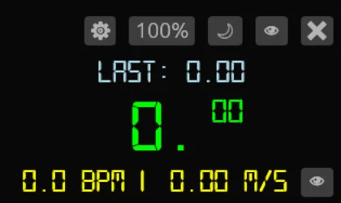

# Phasmoclock 👻⏱️ Global Stopwatch & BPM/Speed Tracker for Phasmophobia

I play phasmo on Linux Steam, needed an overaly clock, did my own. It also works on windows btw.

A lightweight, cross-platform overlay application built in Rust (inspired on phasmo-cheat-sheet by tybayn) . It features a precision stopwatch, a custom BPM-to-Speed (m/s) calculator, and global hardware-level keybinds that work flawlessly regardless of what application has focus.

Designed for phasmophobia specialized tracking (like calculating in-game ghost speeds or speedrunning), the app features a borderless, draggable, always-on-top UI.

**Note: Windows may show a SmartScreen warning because this app is new and unsigned. Click 'More info' and 'Run anyway'.**

## ✨ Features
* **Precision Stopwatch:** Tracks time accurately down to hundredths of a second. Automatically stores and visually compares the previous lap time.
* **Cadence & Speed Tracker:** Tap a hotkey to calculate BPM and automatically convert it to Meters per Second (m/s) based on phasmo footsteps.
* **Speed Configuration:** use `Cycle Speed` keybind to cycle ghost confgured speeds: 50%,75%,100%,125%,150% and the `Blood Moon` keybind to toggle blood moon speed boost.
* **True Global Hotkeys:** Bypasses window focus to catch inputs globally.
  * **Linux:** Uses raw `evdev` to read directly from `/dev/input/`, completely bypassing Wayland security restrictions.
  * **Windows:** Uses `rdev` for native low-level OS hooks.
* **In-App Keybinding:** A floating settings window to rebind actions on the fly. Persists automatically to `bindings.json`.
* **Custom Typography:** Embedded `.ttf` digital clock fonts ensure perfect typographical baselines across platforms.
* **Borderless Overlay:** Clean `gpui` interface that can be dragged anywhere on the screen by clicking the background.

## 🛠️ Tech Stack
* **Language:** Rust
* **GUI Framework:** `gpui`
* **Linux Input:** `evdev`
* **Windows Input:** `rdev`

---

## 🚀 Getting Started

**For Linux (Ubuntu/Debian) Wayland Users:**
use always on top on your wayland manager, (winkey+right click)
